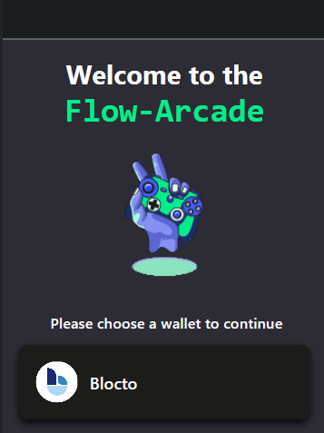

<div>
<br/><br/><br/>
<h1 align="left">Flow-Arcade</h1>
</div>

#### Flow-Arcade is a mobile game platform that offers a collection of exciting games built using React Native on Typescript and Flow blockchain. The platform currently features two games: Coin Dash and Degen Coin Flip.


## Demo Video

<a href="https://youtu.be/lUd6Q3E8l5k" target="_blank">
  <br/>
 
</a>

## Screenshots


## Installation

To run Flow-Arcade locally, follow these steps:

1. Clone the repository:

```bash
git clone https://github.com/Open-Sorcerer/flow-arcade.git
cd flow-arcade
```

2. Install the dependencies:

```bash
npm install
```

3. Start the development server:

```bash
npm run dev:testnet
```

4. Run the app on a simulator or physical device:

```bash
w   # for web
a   # for Android
i   # for iOS
```

## Games

### Coin Dash

Coin Dash is a fast-paced game where the player needs to collect as many coins as possible before the timer runs out. The player must tap the screen to make the character move and collect coins, while avoiding obstacles.

### Degen Coin Flip

Degen Coin Flip is a playful twist on the popular staking game. The player can choose to bet on either "heads" or "tails" and witness a Flow-themed coin flip. The game adds a fun and parody element to the traditional coin flip concept.

## The Problem it Solves

Flow-Arcade addresses the growing demand for engaging and decentralized gaming experiences. It leverages the power of the Flow blockchain and React Native to provide a platform where users can enjoy fun and interactive games with a touch of blockchain technology. By combining the benefits of blockchain, such as transparency, security, and ownership of in-game assets, Flow-Arcade offers a unique gaming experience for players.

## Challenges We Ran Into:

During the development of Flow-Arcade, we encountered several challenges. Some of the notable ones include:

1. **Learning Cadence**:  
   Learning Cadence after building in Ethereum and Solana ecosystems was a new challenging task. It was fun to learn a new language and understand the differences between Cadence and other languages.

2. **Game Design and Development**:  
   We had to ensure smooth gameplay, intuitive controls, and appealing visual aesthetics while integrating blockchain functionality such as asset ownership and in-game rewards.

## Dependencies

Flow-Arcade relies on the following dependencies:

- **fcl-react-native**: A library that facilitates the integration of Flow blockchain functionalities into React Native applications. It simplifies wallet management, transaction handling, and blockchain interactions.

- **React Native**: A popular JavaScript framework for building mobile applications. It allows us to develop cross-platform games with a native-like experience.

- **Expo**: A framework and platform for developing and testing React Native applications. It simplifies the development process and offers various tools and services.

- Other dependencies specified in the `package.json` file.

## Contributing

Contributions to Flow-Arcade are welcome! If you have any ideas, bug reports, or feature requests, please open an issue or submit a pull request.

## License

Flow-Arcade is open source and available under the MIT License.

## Acknowledgements

Flow-Arcade is inspired by the growing interest in blockchain gaming and aims to provide a fun and engaging experience for players. The project draws inspiration from various game development resources and tutorials.

## Contact

For any inquiries or questions, please contact the project maintainers:

1. Suvraneel Bhuin  
   GitHub: [github.com/Suvraneel](https://github.com/Suvraneel)

2. Harsh Ghodkar  
   GitHub: [github.com/Saviour1001](https://github.com/Saviour1001)

3. Aayush Gupta  
   GitHub: [github.com/AAYUSH-GUPTA-coder](https://github.com/AAYUSH-GUPTA-coder)

Feel free to reach out with any feedback or suggestions!
